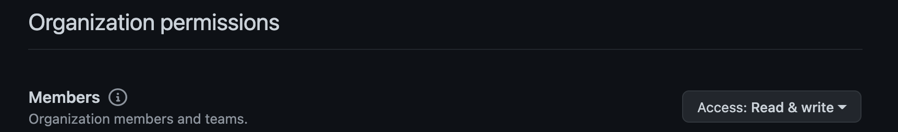

## Setting Up the Github App

First things first, your organization will need to create a new Github App.


### Github App Configuration

1. In your apps permissions configuration, ensure to add `read/write` to membership


2. Setup a Callback URL to the frontend of the Just Ask! This should url that the front end compnent will be accessible by.

3. Setup a description explaining what your version of Just Ask! is used for so that your clients can understand why they are granting access to your Github App

4. Create and save the github app private key, this will be needed to deploy the server

5. Install the application on your desired github organizations

## Server Configuration

The server expects three files: 
1. config.json
2. role-mappers.json
3. github-private-key.pem


`config.json` is a backend descriptor of what installtions this app should expect. Since this application can theoretically be installed anywhere. The server utilizes this file to ensure that only valid changes can be made to the orgs that are configuired from this file.

Sample config.json:
```json
{
  "orgs": [
    "bcgov",
    "bcdevops",
    "patricksimonian",
    "patrick-org-test"
  ],
  "primaryOrg": "patrick-org-test"
}
```

`role-mappers.json` is a description of the three main workflows that a user can take when using this application: APPROVER, COLLABORATOR, REQUESTER. Simply put:
1. Approvers can: automatically invite users into the orgs, approve pending requests
2. Collaboraters can: automatically invite users into the org
3. Requesters can: ask for an invite that requires approval from an APPROVER

Role mappings can be created from specific org roles in an org or membership in a github team. 

```json
{
  "APPROVER": [
    {
      "kind": "OrgRole",
      "role": "owner",
      "name": "bcgov"
    },
    {
      "kind": "GithubTeam",
      "value": "OrgApprovers",
      "organization": "bcgov"
    }
  ],
  "REQUESTER": [null],
  "COLLABORATOR": [
    {
      "kind": "OrgRole",
      "role": "member",
      "name": "bcgov"
    }
  ]
}
```

**Take note of the `null`** field. This is a SPECIAL CASE for `REQUESTER`. If the `index 0` position of `REQUESTER` is `null`. Than any github user is granted that role implicitly. 


## Web Configuration

The web allows some small configuration to have the Github App look and feel more like your organizations branding. This comes into the form of two configuration files:
1. pallete.json
2. content.json

`pallete.json` allows you to adjust the colour scheme of the front end. There is a base scheme and whatever colors you choose to add will override the default ones. It is recommended that you only adjust the `primary` and `secondary` colors.

```json
{
  "primary": "#f6f2ff",
  "secondary": "#e07be0"
}
```

`content.json` allows you to change the title and add a small logo to the header. Consider using a lightweight `png` format image for your logo

```json
{
  "brandTitle": "Platform Services' Github Access Management",
  "brandLogo": "path to my png"
}
```

If you are concerned with fetching an image from the internet, the `brandLogo` path can be absolute (`/path/to/image.png`) and you may mount an image into the run time `public` folder of the web component as you would these two config files. 

## App Installation

The app is designed using microservice architecture and so the three components (front end, backend, database) must be deployed seperately using your preferred hosting environments. Each component contains a README explaining some considerations for a production installation. 


